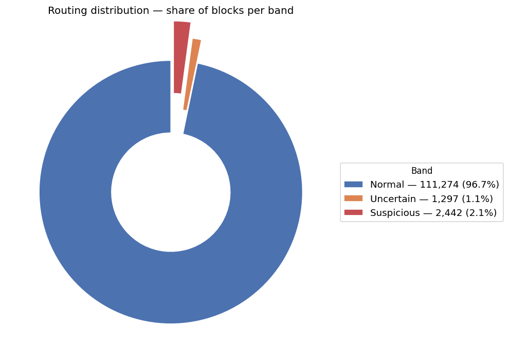
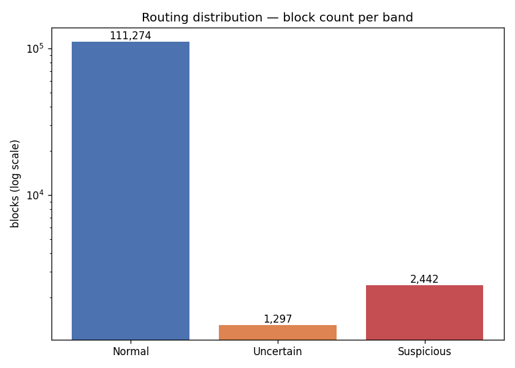
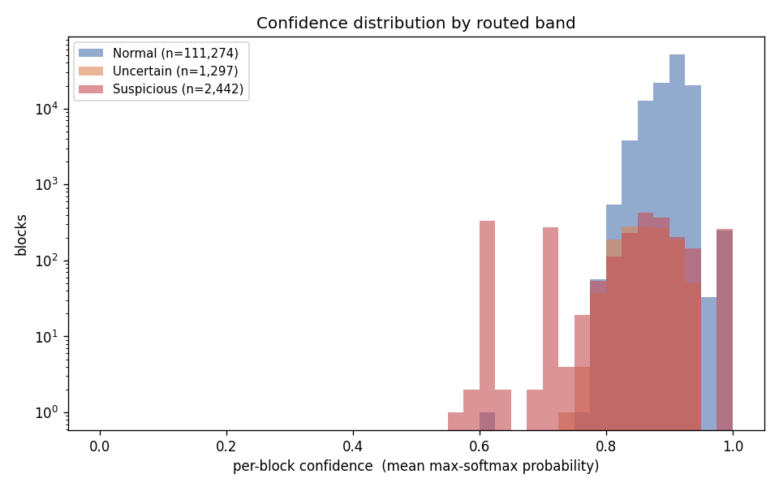

# Routing-Efficiency Report — Normal / Uncertain / Suspicious

_Does the routing layer reduce LLM usage while maintaining good anomaly detection? Generated by `analyze_routing.py` — the production detection routing (normal-only GRU → surprise → validation-derived bands), run over the full held-out test set._

## What was processed

- Routing unit: **115,013 blocks** — each block is one HDFS operation (its full event sequence). Routing decisions are made per block because *suspicion is a property of a whole operation*, not a single event.
- Those blocks span **2,119,158 event windows** — this is the "~2.235M sequences" figure; every one was scored by the GRU (full compute).
- Detector: normal-only GRU (`.checkpoints/normal_only/normal_only/best_model.pt`); routing score `nll_-logp_mean`; band cut-offs derived on a separate validation set (not hand-picked).
- _Footnote: an older per-sequence "hybrid" path routes on MSP **confidence**. The audit showed MSP ranks prediction-correctness, not suspicion (detection AUROC ~0.44), so the production detector routes on **surprise** instead; this report uses the production detector._

## Routing distribution

| Band | Blocks | Share | Avg confidence | Avg anomaly | Actually anomalous |
|---|---|---|---|---|---|
| Normal | 111,274 | 96.7% | 90.3% | 12.4% | 1.0% |
| Uncertain | 1,297 | 1.1% | 86.3% | 25.0% | 25.3% |
| Suspicious | 2,442 | 2.1% | 83.1% | 38.5% | 80.2% |
| **All** | **115,013** | 100.0% | 90.1% | 13.1% | 2.9% |

- **Confidence** = mean max-softmax probability over the block (how sure the GRU was of its own predictions). **Anomaly** = mean surprisal `1 − p(actual)` (how surprised it was by what actually happened). Both ∈ [0, 1].
- _"Actually anomalous" uses ground-truth labels only to GRADE the routing — the detector never sees them. A good router keeps Normal near 0% and concentrates true anomalies in Suspicious._

## Overall averages

- Average confidence score (all blocks): **90.1%**
- Average anomaly score (all blocks): **13.1%**
- Confidence falls and anomaly rises monotonically Normal → Uncertain → Suspicious (see table), which is exactly what a working router should show.

## Is detection still good? (reproduced this run)

- Suspicious-activity **F1 0.674** (Precision 0.802 · Recall 0.581) · **PR-AUC 0.692** · AUROC 0.892.
- This matches the production detection report — routing does **not** trade away detection quality; the same surprise signal both routes and detects.

## The four questions, answered honestly

**1. What percentage of logs were handled entirely by the GRU?**  
**100% of routing *decisions* are the GRU's** — no LLM is needed to classify anything. **96.7%** of blocks land in Normal and are auto-cleared with **zero** LLM cost.

**2. What percentage required Llama?**  
Llama is used only to *explain* flagged blocks (it never decides a label):
- Suspicious + Uncertain (everything escalated): **3.3%** (3,739 blocks).
- Suspicious only: **2.1%** (2,442 blocks).
- Just the ambiguous Uncertain middle: **1.1%** (1,297 blocks).
- LLM needed to *decide* a label: **0%**.

**3. Does the routing layer significantly reduce LLM usage?**  
Yes. At most **3.3%** of blocks ever reach the LLM; **96.7%** never do. Against a naive "explain every block" baseline that is a **31×** reduction in LLM calls, and it is well under the 10–15% target.

**4. Does the routing strategy support the design goal of reducing compute cost?**  
Yes. Assuming ~15s per Llama explanation (measured, `outputs/hybrid_evaluation.md`), explaining **every** block would cost ~476 GPU-hours; routing explains only the flagged 3,739 blocks for ~15.5 GPU-hours — a **31×** saving. The GRU forward pass over all 2,119,158 windows is cheap by comparison.

## Honest caveats

- The Suspicious band is **80.2%** truly anomalous (precision 80.2%) at recall 58.1%: with a 2.9% base rate, a single global threshold trades recall for precision. Per-event-type thresholds (roadmap item 1) are the cheapest way to push recall up.
- Confidence (MSP) is reported here as a **descriptive** per-band statistic; it is **not** the routing signal (surprise is). MSP alone is a poor detector — that is why the production router uses surprise.
- Ground-truth labels are used **only** to grade this report; the live detector is fully unsupervised at inference time.
- Routing is per block, so these percentages are over operations, not individual windows; the GRU still scores every window.

